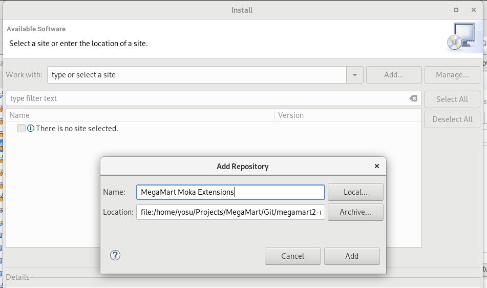
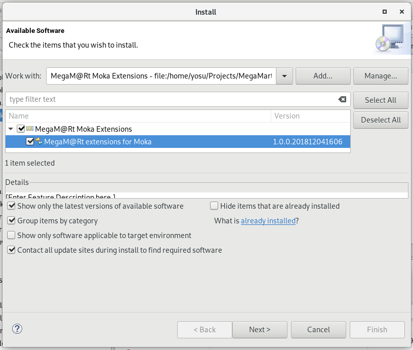

#  MegaM@Rt project: Moka Extensions

This repository contains the code of number of plugins that extend the functionality of Papyrus Moka engine for fUML simulation. It also contains an update site to install them.

## MegaM@Rt Extensions for Moka

- eu.megamart2.moka.logging:
- eu.megamart2.moka.validation:

## Installation
The installation of the MegaM@Rt Extensions for Moka follows the standard Eclipse plugin installation precedure.

### Requirements
MegaM@Rt Extensions for Moka require the following software requirements:
- Git
- Eclipse 2018-09 Modeling (or above)

Note: Eclipse needs to be configured with a default JRE instalation pointed to a JDK (not to a JRE)

### Installation precedure
1. In a command line interface (CMI), pull the **MegaM@Rt Extensions for Moka Repository** to get the update site locally:
`git clone https://gitlab.atosresearch.eu/ari/megamart2-moka.git`
This will create a *megamart2-moka* folder into your local file system

2. In Eclipse, select the top-menu Help/Install New Software. In the Install Wizard, select the Add... button to create a new local repository. Give a name and select the Local... button. Browse your local file system to the Git repository created in previous step. Select the *megamart2-moka/Site/eu.megamart2.moka.extensions.site* folder

3. In Install wizard, select the *MegaM@Rt Extension for Moka* feature, and click on next. Follow next steps, acepting the license and finish. Accept new popup windows that may appear to accept the installation. Restart Eclipse when prompted.

### User Manual

Main contact: Jesús Gorroñogoitia <jesus.gorronogoitia@atos.net>

